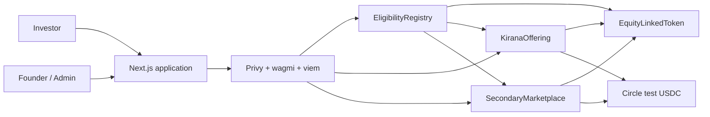

<div align="center">

# SAMA

### Invest in what comes next.

**A testnet marketplace for market-priced startup offerings, equity-linked demo tokens, and transparent settlement on Arbitrum.**

[](https://docs.arbitrum.io/for-devs/dev-tools-and-resources/chain-info)
[](https://soliditylang.org/)
[](LICENSE)
[](https://github.com/EndPx/sama/actions/workflows/security.yml)

**Built for the Arbitrum Open House Singapore Online Buildathon 2026.**

</div>

> [!IMPORTANT]
> SAMA is an in-development, testnet-only hackathon prototype. Every startup, offering, valuation, token, and transaction shown by the demo is simulated. Nothing in this repository constitutes an investment product, securities offering, legal ownership claim, financial advice, or representation of regulatory approval.

## The thesis

The next big startup should not be accessible only through closed networks. SAMA explores a more transparent path from discovery to price formation and ownership records:

```text
Discover -> Evaluate -> Commit -> Reveal -> Clear -> Claim -> Hold -> Transfer
```

The interface speaks the language of startups and investing. Arbitrum stays underneath as the settlement and audit layer.

## What makes SAMA different

- **Market-based price discovery:** bidders commit USDC and seal the highest company valuation they are willing to accept.
- **One clearing valuation:** every winner receives the same uniform price rather than paying their maximum bid.
- **Auditable settlement:** eligibility, commitments, reveals, allocations, refunds, claims, listings, and purchases are verifiable onchain.
- **Human-first onboarding:** embedded wallets and plain-language transaction flows reduce Web3 friction.
- **Disciplined scope:** one startup, one complete lifecycle, and no simulated success states.

## Demo offering

The submission focuses on one fictional Indonesian AI infrastructure startup:

| Term | Value |
|---|---:|
| Startup | Kirana AI |
| Network | Arbitrum Sepolia |
| Payment asset | Circle test USDC |
| Simulated allocation | 10% |
| KIRA offered supply | 1,000,000 |
| FDV range | 4M-6M USDC |
| Minimum raise | 400,000 USDC |

At a 4.8M clearing FDV, the full 10% allocation is worth 480,000 USDC and each KIRA is priced at 0.48 USDC. The arithmetic, contract tests, interface, and demo must all use these same numbers.

## Architecture



The critical path contains four contracts:

1. `EligibilityRegistry` — a simulated testnet allowlist and role boundary.
2. `KiranaOffering` — commit/reveal escrow, uniform-price settlement, claims, refunds, and issuer proceeds.
3. `EquityLinkedToken` — capped KIRA with eligible-address transfer restrictions.
4. `SecondaryMarketplace` — escrowed listings and atomic USDC/KIRA settlement.

Read the authoritative specifications before changing protocol behavior:

- [Auction specification](docs/AUCTION_SPEC.md)
- [Architecture and trust boundaries](docs/ARCHITECTURE.md)
- [Threat model](docs/THREAT_MODEL.md)
- [Implementation plan](docs/IMPLEMENTATION_PLAN.md)
- [Demo runbook](docs/DEMO_RUNBOOK.md)
- [Submission checklist](docs/SUBMISSION_CHECKLIST.md)

## Technology

- Solidity, Foundry, and OpenZeppelin Contracts 5.x
- Next.js, TypeScript, Tailwind CSS, and shadcn/ui
- Privy, wagmi, viem, and TanStack Query
- Arbitrum Sepolia and Circle test USDC
- Ponder and Postgres only after the core onchain lifecycle is complete
- Slither, Foundry fuzz/invariant tests, Gitleaks, and GitHub Actions

## Security posture

SAMA treats security evidence as part of the submission, not a final-day task:

- pull-based token, refund, and proceeds claims;
- bounded settlement and fully verified sorted inputs;
- fund and token conservation invariants;
- role-based access control, pause/cancel escape paths, safe ERC-20 operations, and reentrancy protection;
- automated secret scanning on every push and pull request;
- raw deployer private keys are prohibited from repository env files.

Read [SECURITY.md](SECURITY.md) before configuring wallets, RPC credentials, CI, or deployments.

## Current status

The product and protocol specifications are locked. Implementation proceeds contract-first, with executable auction tests as the first milestone. Deployment addresses and the public demo URL will be published only after the complete two-wallet Arbitrum Sepolia lifecycle passes.

## Hackathon alignment

| Judging criterion | SAMA evidence |
|---|---|
| Smart-contract quality | Commit/reveal lifecycle, bounded verified settlement, restricted token, invariant suite, Slither report |
| Product-market fit | Indonesia-first startup discovery and fundraising experience |
| Innovation and creativity | Uniform-price startup allocation with equity-linked demo tokens |
| Real problem solving | More transparent discovery, pricing, ownership records, and secondary settlement |
| Arbitrum requirement | Verified deployment and transaction evidence on Arbitrum Sepolia |

## Working name

SAMA is a hackathon working name and has not completed trademark or domain clearance.

## License

Released under the [MIT License](LICENSE). This license covers the source code only; it does not grant rights to third-party names, logos, or services.

