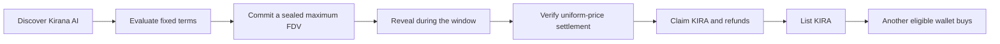

# The solution: one startup, one verifiable lifecycle

SAMA is an Indonesia-first startup-marketplace prototype. It combines a startup-focused interface with a commit–reveal, uniform-price auction and a restricted-token secondary marketplace on Arbitrum Sepolia.

The product promise being tested is simple: **understand the opportunity, express a valuation limit, and verify what happens next.** The hackathon implementation uses fictional Kirana AI, valueless demoUSDC, and simulated equity-linked KIRA. KIRA confers no legal shares, dividends, voting rights, or enforceable economic interest.

## Follow the transaction, not just the screen

| Step | What the participant controls | What the protocol verifies |
|---|---|---|
| Commit | Deposit amount, maximum FDV, secret nonce | One commitment per address, escrow and eligibility |
| Reveal | Submission of the saved bid material | Exact commitment match and exclusive reveal deadline |
| Settle | Anyone may submit the sorted revealed set | Completeness, order, uniqueness, clearing and accounting |
| Claim | Each participant initiates their own claims | Entitlement and one-time withdrawal |
| Trade | Seller sets total price; buyer chooses quantity and maximum cost | Escrow, eligibility, ceiling-rounded cost and atomic delivery |

## Price formation with a concrete answer

The fixed offering sells a simulated 10% allocation represented by one million KIRA. Maximum FDV bids lie between 4M and 6M demoUSDC. The required capital at a candidate FDV is 10% of that FDV; the 400,000 minimum is not an arbitrary fixed clearing target.

In the mandatory five-bid fixture, 700,000 demoUSDC is deposited. The auction clears at 4.8M FDV, accepts 480,000 and makes 220,000 refundable. Bidder B is partially accepted; bidder A is not accepted. All winners use the same 0.48 demoUSDC-per-KIRA clearing price, subject to base-unit allocation rounding. The [auction specification](AUCTION_SPEC.md) contains the authoritative table and algorithm.

## What is distinctive?

The contribution is the connected implementation, not a claim to invent sealed bids or uniform-price auctions. Startup evaluation leads into a valuation-limited allocation, then into independently checkable claims and partial secondary settlement. The same accounting rules run in the contracts and their reference-model tests.

SAMA is not a general-purpose token launchpad, automated market maker, or multi-chain exchange. The marketplace matches an explicit listing with a willing buyer; it provides neither continuous liquidity nor a quoted portfolio value.

## Deliberate trade-offs

- Commit–reveal requires a second transaction and safe backup handling. Deposit amounts remain public, and revealed maximum FDVs become public.
- Settlement is bounded to 64 revealed bids. This makes worst-case work testable but limits capacity and permits denial-of-participation pressure.
- Simulated eligibility is centrally administered, with open self-enrollment for the testnet demo. It is not KYC or Sybil resistance.
- Pull-based claims keep settlement transfers bounded, but participants must return to claim their assets.

The [threat model](THREAT_MODEL.md) records these limitations. The [implementation plan](IMPLEMENTATION_PLAN.md) distinguishes the tested protocol from the unfinished application and deployment gates.
