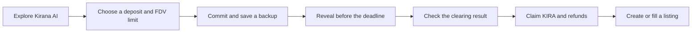

# How SAMA works

SAMA follows one fictional startup offering from discovery to a secondary transfer. Kirana AI is the example company. demoUSDC is the valueless test currency; KIRA is a simulated token with no legal or economic rights.

## Follow one bid

**You choose your limit.** During commitment, you escrow demoUSDC and submit a hash of your maximum FDV and a private nonce. Your deposit and transaction are public. Your FDV stays hidden until you reveal it.

**The contract checks the result.** Once reveal ends, anyone can propose a complete sorted bidder list. The contract verifies the list, finds the highest clearing FDV under the published rules, and records exact accepted amounts and refunds. The submitter cannot simply choose a favorite winner.

**You take the next step.** Winners claim KIRA. Bidders claim positive refunds separately. A holder can list KIRA for a stated total price, and an eligible buyer can fill all or part of the listing. A listing is an offer to sell, not guaranteed liquidity.

## The result in numbers

The reference round offers 1,000,000 KIRA as a simulated 10% allocation. Five bidders deposit 700,000 demoUSDC. The auction clears at a 4.8M FDV, accepts 480,000 and leaves 220,000 refundable. Bidder B is accepted for 30,000 of a 150,000 deposit; bidder A receives a full 100,000 refund. The [worked example](AUCTION_WALKTHROUGH.md) shows each bid and the clearing calculation. The [auction specification](AUCTION_SPEC.md) remains the source for exact base-unit and rounding behavior.

## What the prototype proves

The working contract tests exercise settlement, failed rounds, claim order, unrevealed bids, cancellation, marketplace partial fills, and conservation of assets. The [release page](RELEASE_STATUS.md) links the current evidence and names the public deployment and browser checks still to do.

The experiment uses existing commit–reveal and uniform-price ideas. Its contribution is one connected, reviewable flow: understand an offering, state a valuation limit, see the allocation rule applied, and inspect what happens to the assets afterwards.

Continue with [Getting started](USER_GUIDE.md) for the participant path or [architecture](ARCHITECTURE.md) for contract boundaries.
